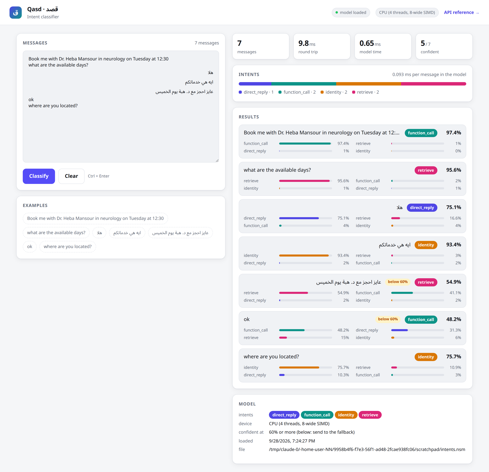
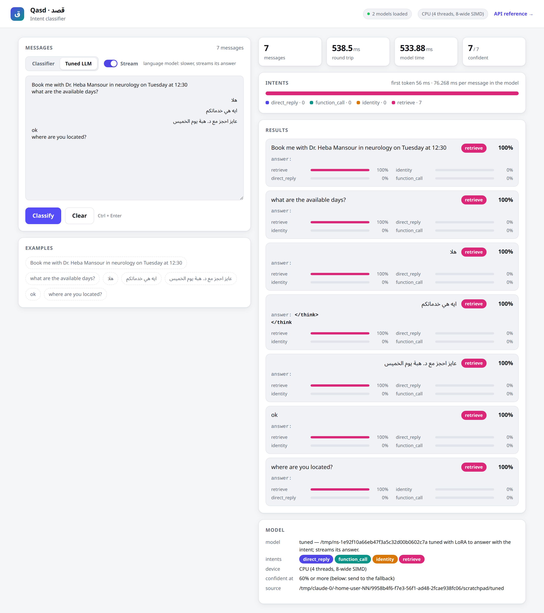

# Qasd (قصد): intent classifier

An application built on [Idrak](https://github.com/ahmedseada/Idrak) (the NuGet packages): it classifies a user's message into an intent
(`retrieve`, `function_call`, `direct_reply`, `identity`, or whatever labels the training data has). It trains on a GPU
or CPU from a CSV of labeled messages and serves predictions from one model file.

| Project | What it is |
|---|---|
| `Qasd.Core` | the classifier (training, evaluation, prediction, one-file save / load) and the intent scoring over a tuned chat model |
| `Qasd` | the command line (`qasd`): train, evaluate, predict, info, split, benchmark; `--tuned` for the tuned model |
| `Qasd.Api` | the HTTP service (ASP.NET Core) serving both models, as one JSON response or streamed; test page and Scalar reference |

`apps/Qasd.slnx` opens all three. The tuned model is tuned with **idrak-tune**, Idrak's general fine-tuning tool
(the `Idrak.FineTuning.Cli` NuGet tool, pinned in `.config/dotnet-tools.json`): Qasd has no fine-tuning code of its own.

| | classifier (`qasd train`) | tuned model (`idrak-tune train`) |
|---|---|---|
| what it is | hashed n-grams and a small network | any pretrained chat model the library loads, taught to answer with the intent |
| trains in | seconds on a CPU | minutes on a GPU (hours on a CPU) |
| predicts in | about 0.1 ms per message on a CPU | tens of milliseconds per message |
| result | intent, confidence, every intent's probability | the same (each intent scored as the model's answer), plus its answer streamed token by token |

How it works: each message becomes a hashed bag of words, word pairs and character 2-4-grams (TF-IDF weighted; Arabic
normalized: diacritics, alef / yaa / taa marbuta forms, Arabic-Indic digits), and a small network built with Idrak
maps it to the intents.

## Install (a new Windows device)

Nothing but the .NET SDK and, for the GPU, the NVIDIA driver: Idrak comes from nuget.org and compiles its CUDA kernels
with the driver (no CUDA toolkit).

```
winget install Git.Git
winget install Microsoft.DotNet.SDK.10
# GPU: the latest NVIDIA Game Ready / Studio driver (570 or newer for RTX 50 cards), then check: nvidia-smi
# open a new PowerShell so both are on the PATH
cd D:\Projects
git clone -b Qasd https://github.com/ahmedseada/NN.git Qasd
cd Qasd
dotnet restore apps/Qasd.slnx
dotnet tool restore                                       (installs idrak-tune from nuget.org)
dotnet build -c Release apps/Qasd.slnx
```

Models downloaded from Hugging Face are cached in `%USERPROFILE%\.cache\idrak` (`IDRAK_CACHE` to move it); `HF_TOKEN`
is only needed for gated models. `IDRAK_DISABLE_CUDA=1` forces the CPU.

## Train

```
dotnet run -c Release --project apps/Qasd -- train apps/Qasd/data/plan-queries.csv
```

The columns default to `raw_question` (text) and `intent` (label); `--text` / `--label` pick others. 20% of the distinct
messages are held out (all copies of a message stay on one side, so the score is on messages the model never saw):
accuracy, per-intent precision / recall / F1 and the confusion matrix are printed. For the model you deploy, train on
everything with `--test-fraction 0`. Other options: `--epochs`, `--batch-size`, `--buckets`, `--hidden`, `--lr`, `--seed`.

## Use

```
dotnet run -c Release --project apps/Qasd -- predict "Book me with Dr. Heba on Tuesday" "هلا"
dotnet run -c Release --project apps/Qasd -- predict --json --min-confidence 0.6 < messages.txt
dotnet run -c Release --project apps/Qasd -- evaluate new-labeled.csv
```

## Where the models go

Both models live in the Qasd project: `qasd train` saves to `apps/Qasd/models/intents.qasd`, and the tuned adapter goes
to `apps/Qasd/models/tuned` (`--out` for elsewhere). `predict` and `evaluate` read them from there unless
given another model, and the service loads both from there with no settings (IntentModel:Path and IntentModel:TunedPath
override; `"TunedPath": "none"` serves the classifier only). The service starts without the tuned model when it has
not been trained yet. Both folders are git-ignored.

## Devices

Training (`qasd train`, `idrak-tune train`) runs on the GPU when there is one (else the CPU, with a notice); `--cpu`
forces the CPU. Inference runs on the CPU unless asked: `predict` and `evaluate` take `--cuda`, and the service takes
`IntentModel__Device=cuda` (classifier) and `IntentModel__TunedDevice=cuda` (tuned model). The classifier is fastest on
the CPU (about 0.1 ms per message); the tuned model is a language model and gains most from the GPU. The benchmarks
measure both devices when there is a GPU (`--devices cpu` or `--devices cuda` for one).

## Tune a language model (idrak-tune)

Split the data once, so the classifier and the tuned model train on the same messages and are scored on the same held-out
ones; then tune with idrak-tune on the training part, with an instruction that lists the intents. Any chat model works
(`$model`: a Hugging Face id, a folder, a .gguf file or `ollama:name`); the small one below is only the one tested here.

```
dotnet run -c Release --project apps/Qasd -- split apps/Qasd/data/plan-queries.csv
$model = "Qwen/Qwen2.5-0.5B-Instruct"
dotnet idrak-tune train $model "apps/Qasd/data/split/train.csv?user={raw_question}&assistant={intent}" --system "Classify the user's message into one intent: direct_reply, function_call, identity, retrieve. Answer with the intent only." --max-length 256 --no-dedup --out apps/Qasd/models/tuned
dotnet run -c Release --project apps/Qasd -- evaluate --tuned apps/Qasd/data/split/test.csv --cuda
dotnet run -c Release --project apps/Qasd -- predict --tuned "Book me with Dr. Heba on Tuesday" --stream
```

idrak-tune writes the adapter and `idrak-tuning.json` (the base model and the instruction it was tuned with), which is
all Qasd needs to load it. Predictions score every intent as the model's answer, so the label is always one of the
intents (taken from the data, the classifier, or `--labels`).

Compare both models on a device (the tuned model's inference; tune it on `split/train.csv` so the measured messages are
unseen):

```
dotnet run -c Release --project apps/Qasd -- benchmark apps/Qasd/data/plan-queries.csv --tuned                   (CPU)
dotnet run -c Release --project apps/Qasd -- benchmark apps/Qasd/data/plan-queries.csv --tuned --devices cpu,cuda
```

## Serve (Qasd.Api)

```
dotnet run -c Release --project apps/Qasd.Api
```

Then open http://localhost:5080: a test page (messages on the left, one per line; each message's intent, confidence
and probabilities with the round-trip and model times on the right). The Scalar API reference, where every endpoint
can be tried, is at http://localhost:5080/scalar.



On the CPU, inference skips the dense product: a message sets a few hundred of the 16,384 features, so the first layer
adds up those rows of its weights (about 0.1 ms per message, 40,000 messages per second in batches on 4 cores). The model file and
settings come from `appsettings.json` (section `IntentModel`), or environment variables such as
`IntentModel__Path=D:\models\intents.qasd`:

| Setting | Default | |
|---|---|---|
| `Path` | `apps/Qasd/models/intents.qasd` | the model file from `qasd train` |
| `Device` | `cpu` | `auto`, `cpu`, `cuda` or `cuda:N` (the CPU is fast enough for single messages) |
| `MinConfidence` | 0.6 | below it a result has `accepted: false`: send the message to your fallback (the LLM planner) |
| `MaxBatch` | 256 | most messages per batch request |
| `MaxTextLength` | 4000 | longest message in characters |
| `AdminKey` | empty | the `X-Admin-Key` for `POST /v1/model/reload`; empty disables reloading |
| `TunedPath` | empty | the tuned adapter folder (from `idrak-tune train`); empty: `apps/Qasd/models/tuned` when it holds one; `none`: the classifier only |
| `TunedDevice` | `auto` | where the tuned model runs: the GPU when there is one (`cpu`, `cuda`, `cuda:N`) |
| `MaxTunedBatch` | 32 | most messages per batch request to the tuned model |
| `DefaultModel` | `classifier` | the model requests use when they name none |

| Endpoint | |
|---|---|
| `POST /v1/classify` | `{"text": "...", "model": "classifier" \| "tuned", "stream": false}` → label, confidence, accepted, every intent's probability |
| `POST /v1/classify/batch` | `{"texts": ["...", "..."], "model": ..., "stream": false}` → the results in order |
| `GET /v1/models` | both models: available, default, intents, device |
| `GET /v1/model` | the model file, its intents, device and load time |
| `POST /v1/model/reload` | after retraining: loads the file again without dropping requests in flight |
| `GET /health` | healthy while a model is loaded |
| `GET /openapi/v1.json` | the OpenAPI document |

With `"stream": true` both classify endpoints answer with Server-Sent Events (`text/event-stream`) instead of one
JSON response:

```
event: token      data: {"index":0,"token":"function"}                    (tuned model: its answer as it is generated)
event: result     data: {"index":0,"result":{"label":"function_call","confidence":0.97,...}}   (one per message)
event: done       data: {"count":1,"elapsedMilliseconds":41.2,"firstTokenMilliseconds":18.5,"model":"tuned"}
```

The test page switches between the two models; with the tuned model selected, the Stream switch shows its answer as it
is generated, with the time to the first token.



The model is loaded at startup (a missing or broken file stops the service with a clear message, not the first
request). Invalid input gets a 400 with ProblemDetails.

From your own .NET code, reference `Qasd.Core` and load the model once:

```csharp
using var classifier = Qasd.TextClassifier.Load("apps/Qasd/models/intents.qasd", Idrak.Device.Cpu);
var p = classifier.Predict(message);          // p.Label, p.Confidence, p.Probabilities; thread-safe
```

## Training data

`apps/Qasd/data/plan-queries.csv`: 5,177 labeled messages (1,872 distinct; Arabic, English and mixed) with the columns
`raw_question` (the text), `semantic_query`, `intent` (the label: `retrieve` 2,983, `function_call` 1,096,
`direct_reply` 973, `identity` 125) and `confidence`. Retrain after adding rows; later rows of the same message count
as more examples of it.

## Postman

`apps/Qasd.Api/Qasd.postman_collection.json`: every endpoint with English and Arabic examples, the validation errors and
the admin reload, each with tests (status, labels, probabilities summing to 1, `accepted` against MinConfidence).
Import it in Postman (variables `baseUrl`, default http://localhost:5080, and `adminKey`), or run it from the command line:

```
npx newman run apps/Qasd.Api/Qasd.postman_collection.json --env-var adminKey=<the service's IntentModel:AdminKey>
```

## Publish

```
dotnet publish apps/Qasd.Api -c Release -o D:\Services\Qasd
```

The folder runs on its own: the trained models (`apps/Qasd/models`: `intents.qasd` and `tuned/`) are copied to
`models/` next to the service, and the test page, the Scalar reference and `appsettings.json` come with it. The machine
needs the ASP.NET Core 10 runtime (or add `-r win-x64 --self-contained` to publish without it) and, for the GPU, the
NVIDIA driver. The tuned model's base weights (named in `models/tuned/idrak-tuning.json`) are read from the download
cache (`%USERPROFILE%\.cache\idrak`, or `IDRAK_CACHE`): on a machine without internet access, copy that folder over.

```
cd D:\Services\Qasd
.\Qasd.Api.exe                                          (http://localhost:5080)
.\Qasd.Api.exe --urls http://0.0.0.0:5080               (reachable from other machines)
```

As a Windows service (an administrator PowerShell; it starts with Windows):

```
sc.exe create Qasd binPath= "D:\Services\Qasd\Qasd.Api.exe --urls http://0.0.0.0:5080" start= auto
sc.exe start Qasd
sc.exe stop Qasd; sc.exe delete Qasd                      (to remove it)
```

Settings go in `appsettings.json` in that folder (section `IntentModel`; `TunedDevice` is `auto`: the GPU when there is
one) or in environment variables. After retraining, publish again (or copy the new models into `models/`) and restart
the service. The command line publishes the same way: `dotnet publish apps/Qasd -c Release -r win-x64 -o D:\Tools\qasd`.
